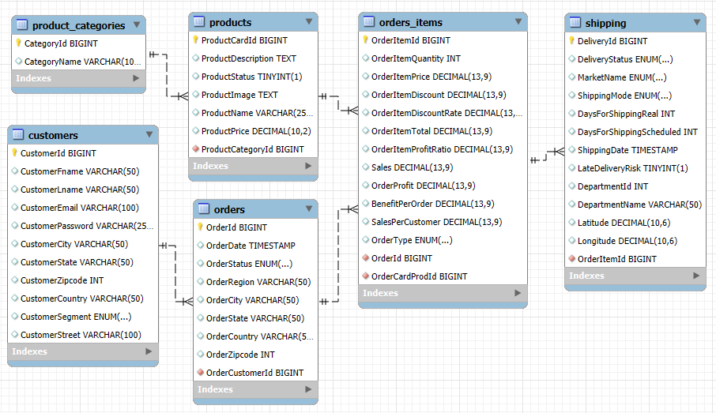

# Predicting On-Time Package Delivery: A Machine Learning Pipeline

## Overview

This project leverages big data and machine learning to optimize supply chain operations using the DataCo Smart Supply Chain Dataset. The goal is to analyze key supply chain metrics, predict demand, optimize stock levels, and enhance logistics efficiency through data-driven insights. The final model, an ExtraTreesClassifier, achieved 94% accuracy.

## Dataset & Database

   - Custom-built database includes:
      - Shipping Orders: ID, status, shipment time, delivery time, etc.
      - Clients: Client demographics and historical behavior
      - Products: Product types, categories, and shipping priority
   - Source: DataCo SMART SUPPLY CHAIN FOR BIG DATA ANALYSIS from Kaggle.
   - Download Link: [Kaggle Dataset](https://www.kaggle.com/datasets/shashwatwork/dataco-smart-supply-chain-for-big-data-analysis/data)



## Key Objectives

   - Predict whether a package will be delivered on time
   - Clean and prepare messy logistics data
   - Understand key delivery delays and risk factors
   - Compare multiple models and select the best-performing one

## Project Structure

```plaintext
/ml-supply-chain
├── data                              # Raw and processed data
├── database                          # SQL and python scripts for dsatbase creation and queries
├── images                            # Visual assets and schema diagrams
├── notebooks                         # Jupyter Notebooks for EDA and modeling
├── reports                           # PDF report with project summary
├── scripts                           # Python scripts for modular tasks
├── .gitattributes                    # Git settings for line endings and LFS
├── .gitignore                        # Files/folders to ignore in version control
├── README.md                         # Project overview and documentation
├── requirements.txt                  # Python dependencies
├── setup.py                          # Setup script for installing the project as a package
```
## Installation & Setup

1. Clone the repository:

   ```bash
   git clone https://github.com/annnieglez/ml-supply-chain
   cd ml-supply-chain
   ```

2. Create and activate a virtual environment:

   ```bash
      python -m venv supply
      source supply/bin/activate        # On macOS/Linux
      source supply\Scripts\activate    # On Windows
   ```

3. Install the project in editable mode:

   ```bash
   pip install -e .
   ```

4. Install additional dependencies:

   ```bash

   pip install -r requirements.txt
   ```

5. Open the project in VS Code and ensure the correct Python interpreter is selected.

6. Run the notebooks or scripts as needed.

## Contributing

Contributions are welcome! If you'd like to contribute, please fork the repository and create a new branch for your changes.

## License

This project is licensed under the MIT License. See the LICENSE file for details.

## Author

This project is licensed under the [MIT License](https://opensource.org/licenses/MIT). See the `LICENSE` file for details.