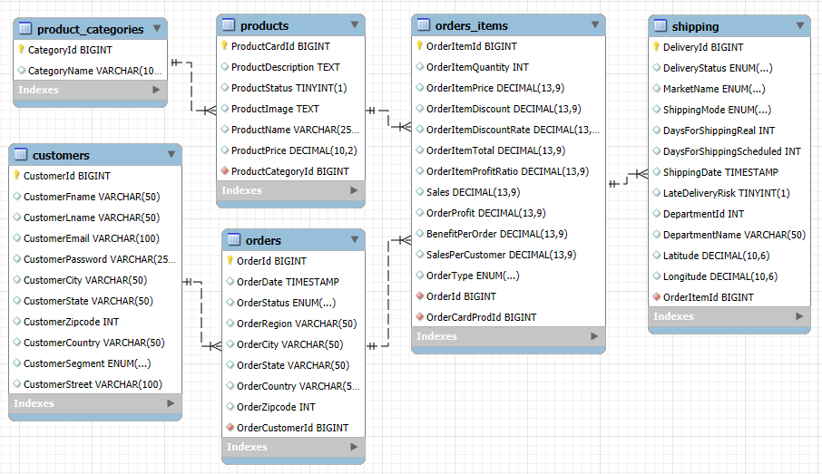

# Database Setup and Usage Guide

This folder contains all necessary files to create, populate, and interact with the `supply_chain_db` MySQL database. The database is used for managing supply chain data and is populated using CSV files located in the `data` folder.



## Folder Structure

```plaintext
/database
│-- create_db.py            # Script to create the database and call schema.sql
│-- schema.sql              # SQL file containing queries to create tables
│-- execute_queries.py      # Script to connect to MySQL and execute queries from Python
│-- queries_examples.sql    # Script to connect to MySQL and execute queries from SQL command line
│-- insert_data_db.py       # Script to call insert_data.sql and populate the database
│-- insert_data.sql         # SQL queries to insert data from CSV files
│-- sql_connection.py       # Script to establish a MySQL connection (asks for password securely)
│-- data/                   # Folder containing CSV files to populate the tables
│   ├── customers_db.csv
│   ├── order_items_db.csv
│   ├── orders_db.csv
│   ├── product_category_db.csv
│   ├── products_db.csv
│   ├── shipping_db.csv
│-- README.md               # This file
```

## Dependencies

Ensure all required libraries are installed by running:

```bash
pip install -r ../requirement_file.txt
```

Additionally, you must run, from the project directory before executing any database scripts.

```bash
pip install -e .
```

This modifies the settings.json file so the CSV files can be accessed from the data folder instead of the default upload directory.

## Troubleshooting

The script `setup.py` modifies the VS Code settings to read the CSV files correctly. If any issues occur, check if the settings file is at the correct location:

```plaintext
Windows: %APPDATA%\Code\User\settings.json
Linux/Mac: ~/.config/Code/User/settings.json
```

If the settings file is missing, manually adjust the paths and rerun ```setup.py```. Alternatively, move the CSV files to the MySQL default directory.

## Steps to Set Up and Run the Database

### 1. Create the database and tables

```bash
pip install -e .
```

Run this from the project directory, not the database folder

### 2. Insert data into the database

```bash
python insert_data.py
```

### 3. Run queries

- From Python:
  
```bash
python execute_queries.py
```

- Directly in MySQL command line:
  
```sql
SOURCE query_examples.sql;
```

## CSV Data Source

The CSV files in the data folder are generated using the Jupyter notebook:

```plaintext
../notebook/data_cleaning_for_database.ipynb
```

For additional details about the dataset, refer to:

```plaintext
../data/README.md
```

## Contact

For any issues, contact me. This setup was tested using Python 3.13.2 and MySQL 8.0.